# 🎯 **Intelligent RAG System - Complete Workflow Diagram**

## **📊 System Architecture Overview**

This comprehensive workflow diagram visualizes the complete Intelligent RAG System implementation as described in the `docs/COMPLETE_IMPLEMENTATION_DOCUMENT.md` file.

---

## **🔄 Main System Workflow**

```mermaid
graph TB
    %% User Input Layer
    User[👤 User Query] --> UI[🖥️ UI Integration Layer]
    
    %% UI Integration
    UI --> |"enhanced_chatbot_response()"| MainInt[🔄 Main Integration System]
    
    %% Main Integration System
    MainInt --> |"Step 1: Get relevant documents"| DocReg[📚 Document Registry]
    MainInt --> |"Step 2: Create query context"| QueryCtx[🧠 Query Context]
    MainInt --> |"Step 3: Get RAG response"| RAG[🤖 Existing RAG System]
    MainInt --> |"Step 4: Analyze query"| IntRouter[🧠 Intelligent Router]
    
    %% Document Registry
    DocReg --> |"Multi-factor relevance scoring"| RelDocs[📄 Relevant Documents]
    RelDocs --> QueryCtx
    
    %% Query Analysis
    IntRouter --> |"Pattern matching & confidence calculation"| AnalysisTrigger[⚡ Analysis Trigger]
    AnalysisTrigger --> |"should_analyze = true"| AgentSel[🎯 Agent Selection]
    AnalysisTrigger --> |"should_analyze = false"| StandardRAG[📝 Standard RAG Response]
    
    %% Agent Selection
    AgentSel --> |"Capability-based routing"| AgentReg[🤖 Agent Registry]
    AgentReg --> |"Best matching agent"| SelectedAgent[🎯 Selected Agent]
    
    %% Analysis Processing
    SelectedAgent --> |"Excel analysis execution"| AnalysisResult[📊 Analysis Result]
    AnalysisResult --> ResponseEnh[✨ Response Enhancer]
    
    %% Response Enhancement
    ResponseEnh --> |"Template-based enhancement"| EnhancedResp[🎨 Enhanced Response]
    RAG --> ResponseEnh
    
    %% Output
    EnhancedResp --> |"HTML formatted response"| UI
    StandardRAG --> |"Markdown response"| UI
    UI --> |"Final response to user"| User
    
    %% Departmental Structure
    subgraph "🏢 Departmental Structure"
        DeptConfig[⚙️ Department Config]
        DeptAgent[🎯 Department Agent]
        DeptConfig --> DeptAgent
        DeptAgent --> AgentReg
    end
    
    %% Central Registry
    subgraph "📚 Central Registry System"
        DocReg
        AgentReg
        DocReg --> |"Document metadata"| DocMeta[📋 Document Metadata]
        AgentReg --> |"Agent capabilities"| AgentCap[🎯 Agent Capabilities]
    end
    
    %% Intelligent Routing
    subgraph "🧠 Intelligent Routing System"
        IntRouter
        PatternMatch[🔍 Pattern Matching]
        ConfCalc[📊 Confidence Calculation]
        IntRouter --> PatternMatch
        IntRouter --> ConfCalc
    end
    
    %% Response Generation
    subgraph "✨ Response Generation System"
        ResponseEnh
        TemplateSys[📝 Template System]
        HTMLGen[🎨 HTML Generation]
        ResponseEnh --> TemplateSys
        ResponseEnh --> HTMLGen
    end
    
    %% Styling
    classDef userLayer fill:#e1f5fe,stroke:#01579b,stroke-width:2px
    classDef systemLayer fill:#f3e5f5,stroke:#4a148c,stroke-width:2px
    classDef dataLayer fill:#e8f5e8,stroke:#1b5e20,stroke-width:2px
    classDef processLayer fill:#fff3e0,stroke:#e65100,stroke-width:2px
    
    class User,UI userLayer
    class MainInt,IntRouter,ResponseEnh systemLayer
    class DocReg,AgentReg,RelDocs,DocMeta,AgentCap dataLayer
    class PatternMatch,ConfCalc,TemplateSys,HTMLGen processLayer
```



---

## **🔍 Detailed Component Workflows**

### **1. Document Registry Workflow**

```mermaid
graph TD
    %% Document Registration
    DocInput[📄 Document Input] --> DocMeta[📋 Document Metadata Creation]
    DocMeta --> |"document_id, file_name, file_type, department, s3_path, description, column_details"| DocReg[📚 Document Registry]
    
    %% Document Storage
    DocReg --> |"Store in documents dictionary"| DocStorage[💾 Document Storage]
    DocReg --> |"Update department services"| DeptServices[🏢 Department Services]
    DocReg --> |"Initialize analysis capabilities"| AnalysisCap[🎯 Analysis Capabilities]
    
    %% Document Retrieval
    Query[🔍 User Query] --> |"get_relevant_documents()"| DocReg
    DocReg --> |"Filter by department"| DeptFilter[🏢 Department Filter]
    DocReg --> |"Calculate relevance score"| RelScore[📊 Relevance Scoring]
    
    %% Relevance Scoring Details
    RelScore --> |"Description match (50%)"| DescMatch[📝 Description Match]
    RelScore --> |"Column details match (30%)"| ColMatch[📊 Column Match]
    RelScore --> |"File name match (10%)"| FileMatch[📁 File Match]
    
    %% Final Output
    DeptFilter --> |"Relevance > 0.3"| RelDocs[📄 Relevant Documents]
    RelScore --> RelDocs
    RelDocs --> |"Sorted by relevance score"| Output[📤 Document List]
    
    %% Styling
    classDef input fill:#e3f2fd,stroke:#0277bd,stroke-width:2px
    classDef process fill:#f1f8e9,stroke:#33691e,stroke-width:2px
    classDef output fill:#fce4ec,stroke:#c2185b,stroke-width:2px
    
    class DocInput,Query input
    class DocMeta,DocReg,RelScore,DeptFilter process
    class RelDocs,Output output
```



### **2. Intelligent Query Analysis Workflow**

```mermaid
graph TD
    %% Input
    Query[🔍 User Query] --> |"QueryContext"| QueryAnalyzer[🧠 Query Analyzer]
    
    %% Excel Document Check
    QueryAnalyzer --> |"Check retrieved documents"| ExcelCheck{📊 Excel Documents Available?}
    ExcelCheck --> |"No"| NoAnalysis[❌ No Analysis Trigger]
    ExcelCheck --> |"Yes"| PatternMatch[🔍 Pattern Matching]
    
    %% Pattern Matching
    PatternMatch --> |"Statistical patterns"| StatPatterns[📈 Statistical Patterns]
    PatternMatch --> |"Data operation patterns"| DataPatterns[🔢 Data Operation Patterns]
    PatternMatch --> |"Visualization patterns"| VizPatterns[📊 Visualization Patterns]
    PatternMatch --> |"Excel-specific patterns"| ExcelPatterns[📋 Excel-Specific Patterns]
    PatternMatch --> |"Comparison patterns"| CompPatterns[⚖️ Comparison Patterns]
    
    %% Confidence Calculation
    StatPatterns --> |"+0.1 per match"| ConfCalc[📊 Confidence Calculation]
    DataPatterns --> |"+0.1 per match"| ConfCalc
    VizPatterns --> |"+0.1 per match"| ConfCalc
    ExcelPatterns --> |"+0.2 per match"| ConfCalc
    CompPatterns --> |"+0.1 per match"| ConfCalc
    
    %% Additional Boosts
    ConfCalc --> |"Multiple Excel docs (+0.1)"| MultiDocBoost[📚 Multiple Documents Boost]
    ConfCalc --> |"Column references (+0.15)"| ColRefBoost[📊 Column Reference Boost]
    
    %% Analysis Type Determination
    ConfCalc --> |"confidence >= 0.6"| AnalysisType[🎯 Analysis Type Determination]
    AnalysisType --> |"Statistical keywords"| StatAnalysis[📈 Statistical Analysis]
    AnalysisType --> |"Data operation keywords"| DataAnalysis[🔢 Data Analysis]
    AnalysisType --> |"Visualization keywords"| VizAnalysis[📊 Visualization Analysis]
    AnalysisType --> |"Excel-specific keywords"| ExcelAnalysis[📋 Excel Analysis]
    AnalysisType --> |"Comparison keywords"| CompAnalysis[⚖️ Comparison Analysis]
    
    %% Column Extraction
    AnalysisType --> |"Extract suggested columns"| ColExtract[📊 Column Extraction]
    ColExtract --> |"Query columns + document columns"| SuggestedCols[📋 Suggested Columns]
    
    %% Final Trigger
    ConfCalc --> |"Final confidence score"| AnalysisTrigger[⚡ Analysis Trigger]
    AnalysisType --> AnalysisTrigger
    SuggestedCols --> AnalysisTrigger
    AnalysisTrigger --> |"should_analyze, confidence, analysis_type, suggested_columns, reasoning"| Output[📤 Analysis Trigger Output]
    
    %% Styling
    classDef input fill:#e3f2fd,stroke:#0277bd,stroke-width:2px
    classDef process fill:#f1f8e9,stroke:#33691e,stroke-width:2px
    classDef decision fill:#fff3e0,stroke:#e65100,stroke-width:2px
    classDef output fill:#fce4ec,stroke:#c2185b,stroke-width:2px
    
    class Query input
    class QueryAnalyzer,PatternMatch,ConfCalc,AnalysisType,ColExtract process
    class ExcelCheck decision
    class AnalysisTrigger,Output output
```



### **3. Agent Selection and Analysis Workflow**

```mermaid
graph TD
    %% Input
    AnalysisTrigger[⚡ Analysis Trigger] --> |"should_analyze = true"| AgentSel[🎯 Agent Selection]
    Query[🔍 User Query] --> AgentSel
    Dept[🏢 Department] --> AgentSel
    
    %% Agent Registry Lookup
    AgentSel --> |"Get department agents"| AgentReg[🤖 Agent Registry]
    AgentReg --> |"Filter by capabilities"| CapFilter[🎯 Capability Filter]
    
    %% Capability Filtering
    CapFilter --> |"Document type support"| DocTypeCheck{📄 Document Type Supported?}
    CapFilter --> |"Analysis type support"| AnalysisTypeCheck{🎯 Analysis Type Supported?}
    
    DocTypeCheck --> |"Yes"| AnalysisTypeCheck
    DocTypeCheck --> |"No"| SkipAgent[⏭️ Skip Agent]
    AnalysisTypeCheck --> |"Yes"| ScoreCalc[📊 Score Calculation]
    AnalysisTypeCheck --> |"No"| SkipAgent
    
    %% Score Calculation
    ScoreCalc --> |"Calculate compatibility score"| AgentScore[📊 Agent Score]
    AgentScore --> |"Score > best_score && score >= threshold"| BestAgent[🏆 Best Agent]
    
    %% Agent Execution
    BestAgent --> |"handler_function()"| AgentExec[⚙️ Agent Execution]
    ExcelDocs[📊 Excel Documents] --> AgentExec
    ChatHistory[💬 Chat History] --> AgentExec
    
    %% Analysis Types
    AgentExec --> |"trend_analysis"| TrendAnalysis[📈 Trend Analysis]
    AgentExec --> |"deficiency_analysis"| DeficiencyAnalysis[❌ Deficiency Analysis]
    AgentExec --> |"compliance_analysis"| ComplianceAnalysis[✅ Compliance Analysis]
    AgentExec --> |"statistical_analysis"| StatisticalAnalysis[📊 Statistical Analysis]
    AgentExec --> |"general_analysis"| GeneralAnalysis[🔍 General Analysis]
    
    %% Analysis Results
    TrendAnalysis --> AnalysisResult[📊 Analysis Result]
    DeficiencyAnalysis --> AnalysisResult
    ComplianceAnalysis --> AnalysisResult
    StatisticalAnalysis --> AnalysisResult
    GeneralAnalysis --> AnalysisResult
    
    %% Output
    AnalysisResult --> |"Formatted analysis result"| Output[📤 Analysis Output]
    
    %% Styling
    classDef input fill:#e3f2fd,stroke:#0277bd,stroke-width:2px
    classDef process fill:#f1f8e9,stroke:#33691e,stroke-width:2px
    classDef decision fill:#fff3e0,stroke:#e65100,stroke-width:2px
    classDef analysis fill:#f3e5f5,stroke:#4a148c,stroke-width:2px
    classDef output fill:#fce4ec,stroke:#c2185b,stroke-width:2px
    
    class AnalysisTrigger,Query,Dept,ExcelDocs,ChatHistory input
    class AgentSel,AgentReg,CapFilter,ScoreCalc,AgentExec process
    class DocTypeCheck,AnalysisTypeCheck decision
    class TrendAnalysis,DeficiencyAnalysis,ComplianceAnalysis,StatisticalAnalysis,GeneralAnalysis analysis
    class AnalysisResult,Output output
```



### **4. Response Enhancement Workflow**

```mermaid
graph TD
    %% Input
    RAGResponse[🤖 RAG Response] --> ResponseEnh[✨ Response Enhancer]
    AnalysisTrigger[⚡ Analysis Trigger] --> ResponseEnh
    QueryContext[🧠 Query Context] --> ResponseEnh
    ExcelDocs[📊 Excel Documents] --> ResponseEnh
    
    %% Analysis Suggestion Decision
    ResponseEnh --> |"should_suggest_analysis()"| SuggestCheck{💡 Suggest Analysis?}
    SuggestCheck --> |"No"| StandardResp[📝 Standard Response]
    SuggestCheck --> |"Yes"| TemplateSel[📝 Template Selection]
    
    %% Template Selection
    TemplateSel --> |"confidence >= 0.8"| HighTemplate[🔥 High Confidence Template]
    TemplateSel --> |"confidence >= 0.6"| MedTemplate[⚡ Medium Confidence Template]
    TemplateSel --> |"confidence >= 0.4"| LowTemplate[💭 Low Confidence Template]
    
    %% Template Formatting
    HighTemplate --> |"Format with topic and columns"| TemplateFormat[📝 Template Formatting]
    MedTemplate --> TemplateFormat
    LowTemplate --> TemplateFormat
    
    %% HTML Generation
    TemplateFormat --> |"Generate HTML response"| HTMLGen[🎨 HTML Generation]
    HTMLGen --> |"Primary response container"| PrimaryContainer[📦 Primary Container]
    HTMLGen --> |"Analysis suggestion box"| AnalysisBox[📊 Analysis Box]
    HTMLGen --> |"Confidence and reasoning"| MetaInfo[ℹ️ Meta Information]
    
    %% Source Extraction
    ExcelDocs --> |"Extract sources"| SourceExtract[📚 Source Extraction]
    SourceExtract --> |"Document names, S3 paths, departments"| Sources[📋 Sources]
    
    %% Enhanced Response Creation
    PrimaryContainer --> EnhancedResp[🎨 Enhanced Response]
    AnalysisBox --> EnhancedResp
    MetaInfo --> EnhancedResp
    Sources --> EnhancedResp
    StandardResp --> EnhancedResp
    
    %% Output
    EnhancedResp --> |"HTML formatted response"| Output[📤 Final Response]
    
    %% Styling
    classDef input fill:#e3f2fd,stroke:#0277bd,stroke-width:2px
    classDef process fill:#f1f8e9,stroke:#33691e,stroke-width:2px
    classDef decision fill:#fff3e0,stroke:#e65100,stroke-width:2px
    classDef template fill:#f3e5f5,stroke:#4a148c,stroke-width:2px
    classDef output fill:#fce4ec,stroke:#c2185b,stroke-width:2px
    
    class RAGResponse,AnalysisTrigger,QueryContext,ExcelDocs input
    class ResponseEnh,TemplateSel,TemplateFormat,HTMLGen,SourceExtract process
    class SuggestCheck decision
    class HighTemplate,MedTemplate,LowTemplate template
    class EnhancedResp,Output output
```



### **5. Complete Data Flow Workflow**

```mermaid
sequenceDiagram
    participant U as 👤 User
    participant UI as 🖥️ UI Layer
    participant MI as 🔄 Main Integration
    participant DR as 📚 Document Registry
    participant IR as 🧠 Intelligent Router
    participant AR as 🤖 Agent Registry
    participant RAG as 🤖 RAG System
    participant RE as ✨ Response Enhancer
    participant AG as 🎯 Analysis Agent
    
    %% User Query
    U->>UI: User Query
    UI->>MI: enhanced_chatbot_response()
    
    %% Document Retrieval
    MI->>DR: get_relevant_documents()
    DR->>DR: Filter by department
    DR->>DR: Calculate relevance scores
    DR->>DR: Sort by relevance
    DR-->>MI: Relevant Documents
    
    %% Query Context Creation
    MI->>MI: Create QueryContext
    MI->>RAG: Generate RAG response
    RAG-->>MI: RAG Response
    
    %% Query Analysis
    MI->>IR: analyze_query()
    IR->>IR: Check for Excel documents
    IR->>IR: Pattern matching
    IR->>IR: Confidence calculation
    IR->>IR: Determine analysis type
    IR->>IR: Extract suggested columns
    IR-->>MI: Analysis Trigger
    
    %% Agent Selection (if analysis needed)
    alt Analysis Required
        MI->>AR: get_appropriate_agent()
        AR->>AR: Filter by capabilities
        AR->>AR: Calculate compatibility scores
        AR-->>MI: Selected Agent
        
        %% Analysis Execution
        MI->>AG: Execute analysis
        AG->>AG: Load Excel data
        AG->>AG: Apply column mapping
        AG->>AG: Perform analysis
        AG-->>MI: Analysis Result
        
        %% Response Enhancement
        MI->>RE: enhance_response()
        RE->>RE: Select template
        RE->>RE: Generate suggestion
        RE->>RE: Create HTML response
        RE-->>MI: Enhanced Response
        
        MI-->>UI: Enhanced Response
    else Standard RAG
        MI->>MI: Process standard RAG
        MI-->>UI: Standard Response
    end
    
    %% Final Response
    UI-->>U: Final Response
```



---

## **🏗️ System Architecture Components**

### **Central Registry System**
- **Document Registry**: Manages document metadata and relevance scoring
- **Agent Registry**: Manages agent capabilities and routing
- **Department Services**: Maps departments to available services

### **Intelligent Routing System**
- **Query Analyzer**: Analyzes queries for analysis intent
- **Pattern Matching**: Matches queries against analysis patterns
- **Confidence Calculation**: Calculates analysis confidence scores
- **Analysis Type Determination**: Determines required analysis type

### **Response Generation System**
- **Response Enhancer**: Enhances RAG responses with analysis suggestions
- **Template System**: Manages analysis suggestion templates
- **HTML Generator**: Creates professional HTML responses
- **Source Extractor**: Extracts and formats source information

### **Departmental Structure**
- **Department Configuration**: Department-specific settings
- **Analysis Agents**: Specialized agents for each department
- **Column Mappings**: Department-specific column name mappings
- **Analysis Types**: Department-specific analysis capabilities

### **UI Integration Layer**
- **Session Management**: Manages chat histories and sessions
- **Response Formatting**: Formats responses for UI display
- **Error Handling**: Handles errors and provides fallbacks
- **Integration Points**: Connects with existing UI components

---

## **📊 Key Data Structures**

### **Document Metadata**
```python
@dataclass
class DocumentMetadata:
    document_id: str
    file_name: str
    file_type: DocumentType
    department: str
    sub_department: Optional[str]
    s3_path: str
    description: str
    column_details: Optional[str]
    analysis_capabilities: List[str]
    last_updated: str
```

### **Analysis Trigger**
```python
@dataclass
class AnalysisTrigger:
    should_analyze: bool
    confidence: float
    analysis_type: AnalysisType
    suggested_columns: List[str]
    reasoning: str
```

### **Enhanced Response**
```python
@dataclass
class EnhancedResponse:
    primary_response: str
    analysis_suggestion: Optional[str]
    suggested_columns: List[str]
    confidence_score: float
    sources: List[str]
    display_format: str
    analysis_available: bool
    reasoning: str
```

---

## **🎯 Key Benefits Visualized**

1. **Automatic Analysis Detection**: No manual keywords required
2. **Seamless Integration**: Analysis suggestions appear naturally
3. **Intelligent Routing**: Context-aware decision making
4. **Scalable Architecture**: Easy to add new departments
5. **Professional UI**: Enhanced visual presentation
6. **Complete Attribution**: Full source transparency

---

## **🚀 Implementation Phases**

1. **Phase 1**: Core system setup and testing
2. **Phase 2**: UI integration and user experience
3. **Phase 3**: Department expansion and customization
4. **Phase 4**: Advanced features and optimization

This workflow diagram provides a comprehensive visualization of the entire Intelligent RAG System, showing how all components work together to provide seamless, intelligent analysis capabilities.
